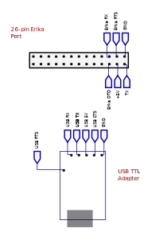
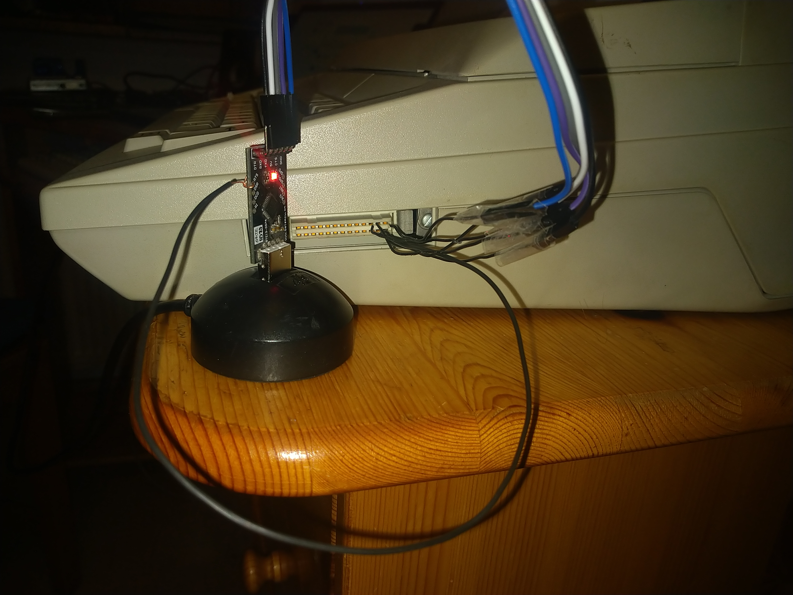

# Erika s3004 Computer Interface

**this is a copy of the original repository at: https://codeberg.org/jbb/erika_S3004**


Tested on a SIGMA SM 8200i, which is supposedly the same hardware just under the brand name used in Western Germany.

This project is based on information from [Chaostreff Potsdam](https://github.com/Chaostreff-Potsdam/erika3004).

## Hardware
- A 5V USB TTL adapter (I used [this](https://www.amazon.de/USB-TTL-Konverter-Modul-mit-eingebautem-CP2102/dp/B00AFRXKFU) one, which I still had lying around)
- A few pieces of wire, to connect the pins of the TTL USB Adapter with the typewriter.

Note: although the typewriter turns on when the 5V pin is connected, the external power source is still needed in order to do anything with it.

| USB TTL | Erika |
|---------|-------|
| RX      | TX    |
| TX      | RX    |
| 5V      | 5V    |
| CTS     | RTS   |
| GND     | GND   |
| RTS     | DTD   |






## Software

### Building and running

Building:
```
cargo build --release
```

Printing some text:
```
./target/release/erika-cli print text.txt
```

For more commands, have a look at the help page:
```
./target/release/erika-cli --help
```
